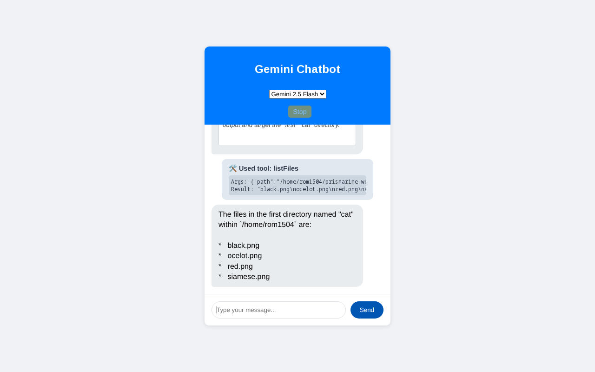

# Gemini Agentic Chatbot Demo

A powerful, full-stack chatbot harness built to demonstrate the capabilities of **Google Gemini 3** and **Gemini 2.5 Flash** using the **Amp** AI coding agent.



## Overview

This project is a web-based agentic harness that connects to the Google Gemini API. It provides a rich user interface for interacting with Gemini models, specifically highlighting their **reasoning capabilities ("Thinking Process")** and **tool usage**.

It was built entirely using **Amp**, showcasing how an AI coding assistant can rapidly generate complex, full-stack applications with advanced AI integration.

## Key Features

*   **🧠 Thinking Process Visualization**: Streams and displays the model's internal reasoning ("Thoughts") in real-time before it generates a final answer.
*   **🛠️ Agentic Tool Use**: The model can autonomously use server-side tools to solve problems:
    *   `fibonacci(n)`: Calculates Fibonacci numbers.
    *   `findFiles(pattern, path)`: Recursively searches for files.
    *   `listFiles(path)`: Lists contents of directories.
*   **🔄 Sequential Tool Execution**: The backend handles multi-step reasoning, allowing the model to search for a directory and then list its files in a single turn.
*   **⚡ Dual Model Support**: Seamlessly switch between:
    *   **Gemini 2.5 Flash**: Optimized for speed and efficiency.
    *   **Gemini 3 Pro**: High-reasoning capability for complex tasks.
*   **🛑 Interrupt Control**: Ability to stop long-running requests mid-stream.
*   **🌊 Real-time Streaming**: Fully streaming UI for immediate feedback.

## Prerequisites

*   Node.js (v18+)
*   A Google Gemini API Key (Get one at [aistudio.google.com](https://aistudio.google.com/))

## Installation

1.  **Clone the repository**:
    ```bash
    git clone <repository-url>
    cd <repository-directory>
    ```

2.  **Install dependencies**:
    ```bash
    npm install
    ```

3.  **Configure API Key**:
    Create a `.env` file in the root directory and add your API key:
    ```env
    GEMINI_API_KEY=AIzaSy...
    ```

## Usage

1.  **Start the server**:
    ```bash
    node server.js
    ```

2.  **Open the Web UI**:
    Navigate to `http://localhost:3000` in your browser.

3.  **Try these prompts**:
    *   *"Calculate the 15th Fibonacci number."* (Uses Math tool)
    *   *"Find the file named 'server.js' and tell me what other files are in that directory."* (Uses Sequential Search + List tools)
    *   *"Why is the sky blue?"* (Demonstrates pure reasoning)

## Testing

Run the automated test suite to verify the server and frontend:

```bash
node test.js
```
